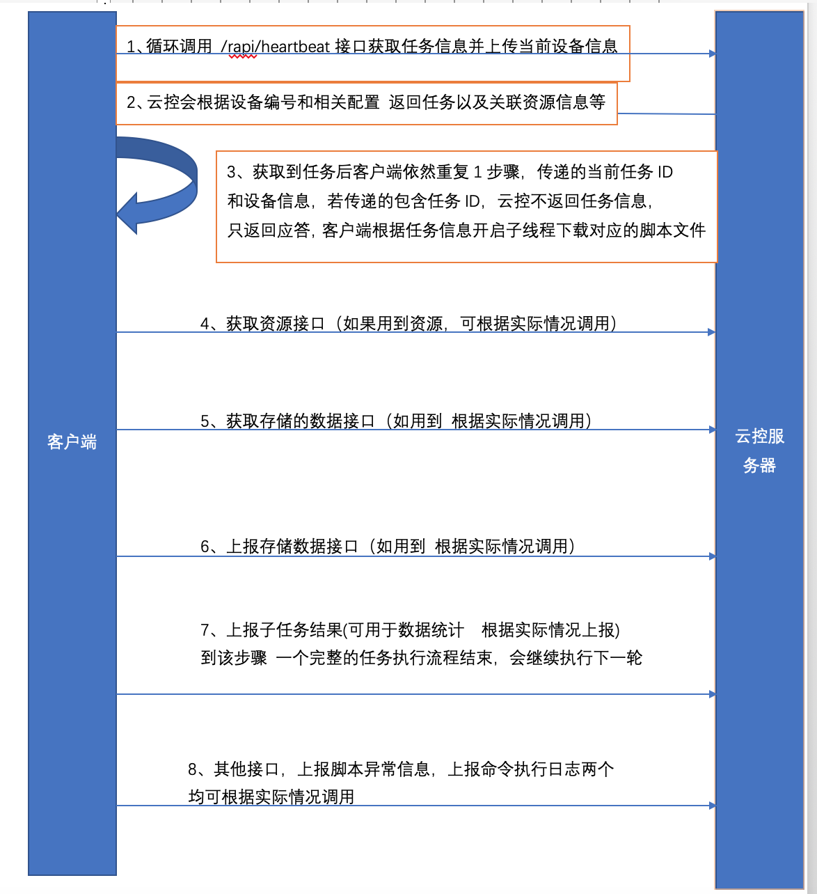

### 说明

- 阐述: 本文档主要描述ecloud云控系统的通信协议，包括任务下发流程、数据回传等，对于不使用EC编写脚本，但是想接入ecloud云控的客户，请详细阅读该文档
- 适用: 本文档适用ecloud 1.6.0以上版本


### 系统任务执行流程

- 该章节描述了ecloud系统如何下发任务，具体如何创建任务请参考ecloud.zip压缩文件中的部署文档说明

- 定义解释：请参见 https://easyclick.gitee.io/docs/#/zh-cn/ecloud/intro

- 重要说明：设备编号是系统唯一认定设备的标识，需要在手机端和云控端一一对应，ecloud 1.6.0以上版本使用的是普通的HTTP协议

- 详细流程

  


### 详细接口说明

- 通信采用http协议，请求方式为post，数据格式为post json, Java的jsoup请求实例

  ```java
   public static String postJSON(String url, JSONObject jsonObject, int timeout) {
        
          try {
              Connection.Response response
                      = Jsoup.connect(url)
                      .ignoreHttpErrors(true)
                      .ignoreContentType(true)
                      .maxBodySize(100 * 1024 * 1024)
                      .requestBody(jsonObject.toString())
                      .header("Content-Type", "application/json;charset=UTF-8")
                      .timeout(timeout)
                      .method(Connection.Method.POST)
                      .execute();
              if (response != null) {
                  String s = response.body();
                 
                  return s;
              }
          } catch (IOException e) {
              
          }
          return null;
      }
  ```

  


#### 1、心跳任务信息接口

- 该接口传递当前执行的任务信息和消息，也传递设备状态，复用接口模式，传递的数据会在云控系统-监控告警-设备监控中展示出来
- 响应参数有三种情况，1无任务和命令，2 一键命令消息，3 任务消息，具体查看实例
- 接口名称 : http://192.168.0.1:8099/rapi/heartbeat
- 提交方式：POST JSON方式

- 请求参数

  ```json
  {
  	"apkVersion": "5.12.0", // 打包后的APK版本，非EC APK接入的可忽略
  	"ecVersion": "5.12.0", //EC源版本，非EC APK接入的可忽略
  	"imei": "123333",//手机的IMEI号，可以为空
  	"deviceNo": "001",//手机的设备编号，不能为空
  	"androidId": "9283223",//手机的androidid，可以为空
  	"brand": "HUWEI",//手机品牌，可以为空
  	"model": "A69",//手机的机型，可以为空
  	"osVersion": "6.1",//手机的版本号，可以为空
  	"sdCardSpace": 10240000,//手机的存储卡总空间，可以为0
  	"sdCardLeftSpace": 1024000,//手机的剩余存储卡空间，可以为0
  	"availMemory": 102400000,//可用内存，可以为0
  	"totalMemory": 1024000000,//总内存，可以为0
  	"battery": 90,//当前电量，可以为0，最好传递，方便监控告警
  	"batteryTemp": 30,//当前电池温度，可以为0，最好传递，方便监控告警
  	"isCharging": 1,//是否在充电，1是 0否
  	"brightness": 100,//屏幕亮度，可以为0
  	"runMode": "无障碍",//运行模式，代理或者无障碍，非EC APK接入可忽略
  	"serviceOk": 1,// 自动化服务是否正常，1是 0否，非EC APK接入可忽略
  	"action": "heartbeat",//请求类型，固定为heartbeat
  	"taskId": "123",//当前正在执行的任务ID，如果当前正在执行任务为必传，防止多次下发任务
  	"taskName": "测试任务",//当前正在执行任务的名称
  	"cmdSubId": "",//当前执行一键命令的ID，如果正在执行命令，这个值为必传
  	"data": [{//消息节点
      	"taskId":"123",//当前正在执行的任务ID，如果当前正在执行任务为必传，防止多次下发任务
          "taskName":"测试任务",//当前正在执行任务的名称
          "msg":"正在打开APP",//消息，会在云控-设备监控中看到该消息
          "deviceNo":"001",//设备编号
          "createTimestamp":1509273923//当前时间，毫秒级别
      }]
  }
  ```

  

- 响应参数（无任务返回）

  ```json
  {
  	"code": 0,//0 代表正常，其他均不正常
  	"msg": "", //错误消息
  	"data": { //数据体
      "action":"resp" // 无任务和命令响应
  		}
  }
  ```

  

- 响应参数（一键命令返回）

  ```json
  {
  	"code": 0,//0 代表正常，其他均不正常
  	"msg": "", //错误消息
  	"data": { //数据体
      "action":"where", // 任务响应,值为 where：查找设备，
      //inst：安装apk，rebphone：重启手机
      //stsc：停止脚本，shellcmd：执行shell命令
      "cmdSubId":"",//命令的ID
      "content":"下载地址或者shell命令",//当action=inst,这个是apk下载地址
      //当action=shellcmd时，这个值是命令字符串
  		}
  }
  ```

  

- 响应参数（任务返回）

```json
{
	"code": 0,//0 代表正常，其他均不正常
	"msg": "", //错误消息
	"data": { //任务消息体
		"action": "task",//任务类型的返回
		"taskId": "123",//云端主任务ID
		"taskName": "测试任务",//云端主任务名称
		"scriptId": "123",//脚本的云端ID
		"scriptName": "测试脚本",//脚本名称
		"scriptUrl": "http://192.168.0.3:8099/profile/a.js",//脚本的下载地址
		"scriptVersion": "1.0",//脚本的版本号
		"subTasks": [{//子任务集合
			"subTaskId": "132",//子任务云端ID
			"subTaskName": "子任务1",//子任务名称
			"resourceGroupId": "11",//资源组云端ID
			"extraParam": "",//子任务扩展参数字符串
			"resources": [{//设定任务关联的组
				"name": "资源1",//资源名称
				"content": "我是资源1",//资源内容
				"type": 1//资源类型, 1 字符串 2 图片 3 视频 4 文件
			}]
		}],
		"network": {//网络资源对象
			"address": "128.2.3.2",//网络资源地址
			"userName": "1111",// 网络资源用户名
			"password": "3xd",//网络资源密码
			"protocolType": 0,//网络资源协议类型, 0、 PPTP 1、L2TP
			"mppeType": "1",//传输是否需要MPPE加密, 1是/0否
			"shareKey": ""//L2TP用的秘钥
		}
	}
}
```


#### 获取资源接口


#### 获取存储数据接口


#### 上报数据存储接口


#### 上报子任务结果接口


#### 上报脚本异常接口


#### 上报命令执行日志接口


