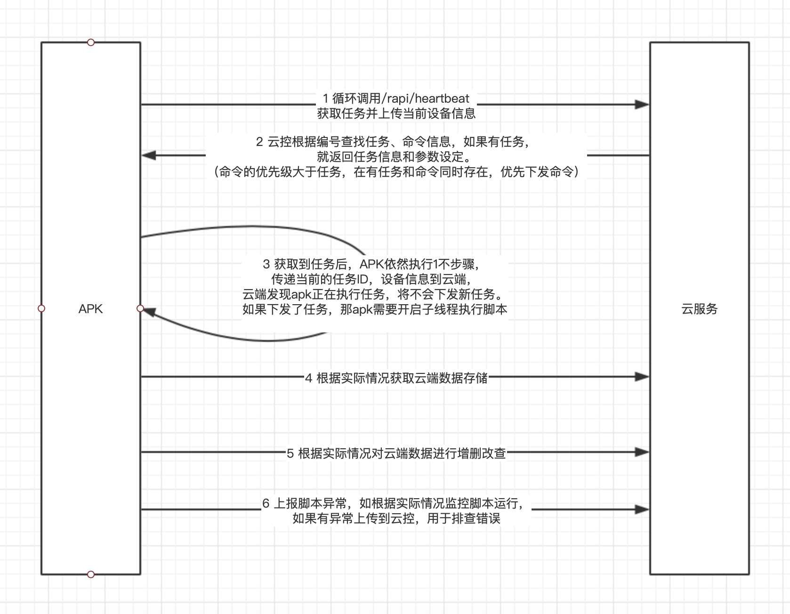

### 说明

- 阐述: 本文档主要描述ecloud云控系统的通信协议，包括任务下发流程、数据回传等，对于不使用EC编写脚本，但是想接入ecloud云控的客户，请详细阅读该文档
- 适用: 本文档适用ecloud 2.0 以上版本


### 系统任务执行流程

- 该章节描述了ecloud系统如何下发任务，具体如何创建任务请参考ecloud.zip压缩文件中的部署文档说明

- 定义解释：请参见 https://easyclick.gitee.io/docs/#/zh-cn/ecloud2/intro

- 重要说明：设备编号是系统唯一认定设备的标识，需要在手机端和云控端一一对应，ecloud 2.0 以上版本使用的是普通的HTTP协议

- 详细流程

  


### 详细接口说明

- 通信采用http协议，请求方式为post，数据格式为post json, Java的jsoup请求实例

  ```java
   public static String postJSON(String url, JSONObject jsonObject, int timeout) {
        
          try {
              Connection.Response response
                      = Jsoup.connect(url)
                      .ignoreHttpErrors(true)
                      .ignoreContentType(true)
                      .maxBodySize(100 * 1024 * 1024)
                      .requestBody(jsonObject.toString())
                      .header("Content-Type", "application/json;charset=UTF-8")
                      .timeout(timeout)
                      .method(Connection.Method.POST)
                      .execute();
              if (response != null) {
                  String s = response.body();
                 
                  return s;
              }
          } catch (IOException e) {
              
          }
          return null;
      }
  ```

  

#### 注意

1、统一请求接口参数是JSON格式，data节点是实际的请求数据，请对data 的JSON数据进行base64编码后，放到data节点中

例如：

```json
{
 "deviceNo":"001",//设备编号
 "data":"eyJkZXZpY2VObyI6IjAwMSIsImFuZHJvaWRJZCI6IjMzMzY5MzdlNDBmMmE4NDAiLCJicmFuZCI6\nIkhPTk9SIiwibW9kZWwiOiJZQUwtQUw1MCIsIm9zVmVyc2lvbiI6IjEwIiwic2RDYXJkU3BhY2Ui\nOjExODQwNzI5OTA3Miwic2RDYXJkTGVmdFNwYWNlIjozMDIwMjQ0MTcyOCwidG90YWxNZW1vcnki\nOjU5NTAzNDUyMTYsImF2YWlsTWVtb3J5Ijo2NTAyMTEzMjgsImJhdHRlcnkiOjU1LCJiYXR0ZXJ5\nVGVtcCI6MjcsImlzQ2hhcmdpbmciOjEsImJyaWdodG5lc3MiOjY4LCJhcGtWZXJzaW9uIjoiNi45\nLjAiLCJlY1ZlcnNpb24iOiI2LjkuMCIsInJ1bk1vZGUiOiLml6Dpmpznoo0iLCJzZXJ2aWNlT2si\nOjAsImNtZFN1YklkIjoiIiwiYWN0aW9uIjoiaGVhcnRiZWF0In0=\n"
}
```

data在base64解码后，是真正要提交的JSON数据

2、统一返回参数

data是返回的参数base64加密的数据，请执行进行base64解密

```json
{
	"code": 0,//0 代表正常，其他均不正常
	"msg": "", //错误消息
	"data":"xxxxxx"
}
```

3、以下接口将不对请求和返回进行描述，只对请求实际的data节点包含的字段进行描述


#### 1、心跳任务信息接口

- 该接口传递当前执行的任务信息和消息，也传递设备状态，复用接口模式，传递的数据会在云控系统-监控告警-设备监控中展示出来

- 响应参数有三种情况，1无任务和命令，2 一键命令消息，3 任务消息，具体查看实例

- 接口名称 : http://192.168.0.1:8099/rapi/heartbeat

- 提交方式：POST JSON方式

- 请求参数

- data是实际提交的JSON数据的base64编码

  ```json
  {
   "deviceNo":"001",//设备编号
   "data":"eyJkZXZpY2VObyI6IjAwMSIsImFuZHJvaWRJZCI6IjMzMzY5MzdlNDBmMmE4NDAiLCJicmFuZCI6\nIkhPTk9SIiwibW9kZWwiOiJZQUwtQUw1MCIsIm9zVmVyc2lvbiI6IjEwIiwic2RDYXJkU3BhY2Ui\nOjExODQwNzI5OTA3Miwic2RDYXJkTGVmdFNwYWNlIjozMDIwMjQ0MTcyOCwidG90YWxNZW1vcnki\nOjU5NTAzNDUyMTYsImF2YWlsTWVtb3J5Ijo2NTAyMTEzMjgsImJhdHRlcnkiOjU1LCJiYXR0ZXJ5\nVGVtcCI6MjcsImlzQ2hhcmdpbmciOjEsImJyaWdodG5lc3MiOjY4LCJhcGtWZXJzaW9uIjoiNi45\nLjAiLCJlY1ZlcnNpb24iOiI2LjkuMCIsInJ1bk1vZGUiOiLml6Dpmpznoo0iLCJzZXJ2aWNlT2si\nOjAsImNtZFN1YklkIjoiIiwiYWN0aW9uIjoiaGVhcnRiZWF0In0=\n"
  }
  
- data对应的JSON字段定义

  ```json
  {
  	"apkVersion": "5.12.0", // 打包后的APK版本，非EC APK接入的可忽略
  	"ecVersion": "5.12.0", //EC源版本，非EC APK接入的可忽略
  	"imei": "123333",//手机的IMEI号，可以为空
  	"deviceNo": "001",//手机的设备编号，不能为空
  	"androidId": "9283223",//手机的androidid，可以为空
  	"brand": "HUWEI",//手机品牌，可以为空
  	"model": "A69",//手机的机型，可以为空
  	"osVersion": "6.1",//手机的版本号，可以为空
  	"sdCardSpace": 10240000,//手机的存储卡总空间，可以为0
  	"sdCardLeftSpace": 1024000,//手机的剩余存储卡空间，可以为0
  	"availMemory": 102400000,//可用内存，可以为0
  	"totalMemory": 1024000000,//总内存，可以为0
  	"battery": 90,//当前电量，可以为0，最好传递，方便监控告警
  	"batteryTemp": 30,//当前电池温度，可以为0，最好传递，方便监控告警
  	"isCharging": 1,//是否在充电，1是 0否
  	"brightness": 100,//屏幕亮度，可以为0
  	"runMode": "无障碍",//运行模式，代理或者无障碍，非EC APK接入可忽略
  	"serviceOk": 1,// 自动化服务是否正常，1是 0否，非EC APK接入可忽略
  	"action": "heartbeat",//请求类型，固定为heartbeat
  	"taskId": "123",//当前正在执行的任务ID，如果当前正在执行任务为必传，防止多次下发任务
  	"taskName": "测试任务",//当前正在执行任务的名称
  	"cmdSubId": "",//当前执行一键命令的ID，如果正在执行命令，这个值为必传
  	"msg":"正在打开APP",//消息，会在云控-设备监控中看到该消息
    "createTimestamp":1509273923//当前时间，毫秒级别
  }
  ```
  
- 响应参数（无任务返回）

  ```json
  {
  	"action": "resp"
  }
  ```
  
  
  
- 响应参数（一键命令返回）

  ```json
  {
  	"action": "where", // 任务响应,值为 where：查找设备，
  	//inst：安装apk，rebphone：重启手机
  	//stsc：停止脚本，shellcmd：执行shell命令
  	//stsc2: 停止脚本
  	"cmdSubId": "", //命令的ID
  	"content": "下载地址或者shell命令" //当action=inst,这个是apk下载地址
  	//当action=shellcmd时，这个值是命令字符串
  }
  ```

  

- 响应参数（任务返回）

```json
{
	"action": "task", //任务类型的返回
	"taskId": "123", //云端主任务ID
	"taskName": "测试任务", //云端主任务名称
	"scriptId": "123", //脚本的云端ID
	"scriptName": "测试脚本", //脚本名称
	"scriptUrl": "http://192.168.0.3:8099/profile/a.js", //脚本的下载地址
	"scriptVersion": "1.0", //脚本的版本号
	"scriptMd5": "xxxxx", //脚本文件的MD5，用于校验比较文件下载结果
	"valueJson": { //任务的参数设定，云控后台的任务-参数设定功能保存的数据
		"x1": "1",
		"x2": "1111",
		"x3": "3xd",
		"x4": "1",
		"aaa": "1",
		"bb": ""
	}
}
```


#### 2、获取存储数据接口

- 说明：该接口是为了获取云控端存储的数据

- 接口名称: http://192.168.0.1:8099/rapi/getData

- 提交方式：POST JSON方式

- data对应的JSON字段定义 

  ```json
  {
  	"deviceNo":"001",//当前设备编号
    "groupName":"数据组1",// 数据组名称
    "dataName":"123455"//数据的唯一标识
  }
  ```

  

- 响应参数

  ```json
  [ //记录列表
  	{
  		"id": "1", //数据id
  		"name": "xxx", //数据的名称
  		"content": "xxx" //数据内容
  	}
  ]
  ```
  
  


#### 3、上报数据存储接口

- 说明：该接口是为了上传要存储的数据

- 接口名称: http://192.168.0.1:8099/rapi/addData

- 提交方式：POST JSON方式

- 请求参数: 

  ```json
  {
  	"dataKey":"13",//存储数据的唯一标示
    "groupName":"数据组1",//  数据的组名，如果云端没有这个组，会自动创建
    "content":"ddd"//数据内容
  }
  ```

  

- 响应参数

  ```json
  {
  	"result": 1//大于0代表正常，其他代表不正常
  }
  ```
  


#### 4、更新数据存储接口

- 说明：该接口是为了更新存储的数据

- 接口名称: http://192.168.0.1:8099/rapi/updateData

- 提交方式：POST JSON方式

- 请求参数: 

  ```json
  {
  	"dataKey":"13",//存储数据的唯一标示
    "groupName":"数据组1",//  数据的组名
    "content":"ddd"//数据内容
  }
  ```

  

- 响应参数

  ```json
  {
  	"result": 1//大于0代表正常，其他代表不正常
  }
  ```

  

#### 5、删除数据存储接口

- 说明：该接口是为了删除存储的数据

- 接口名称: http://192.168.0.1:8099/rapi/removeData

- 提交方式：POST JSON方式

- 请求参数: 

  ```json
  {
  	"dataKey":"13",//存储数据的唯一标示
    "groupName":"数据组1"//  数据的组名
  }
  ```

  

- 响应参数

  ```json
  {
  	"result": 1//大于0代表正常，其他代表不正常
  }
  ```


#### 6、追加一条数据接口

- 说明：该接口是为了追加存储的数据

- 接口名称: http://192.168.0.1:8099/rapi/appendOneLineData

- 提交方式：POST JSON方式

- 请求参数: 

  ```json
  {
  	"dataKey":"13",//存储数据的唯一标示
    "groupName":"数据组1",//  数据的组名
    "content":"ddd"//数据内容
  }
  ```

  

- 响应参数

  ```json
  {
  	"result": 1//大于0代表正常，其他代表不正常
  }
  ```

  

#### 6、删除一条数据接口

- 说明：该接口是为了删除一条存储的数据

- 接口名称: http://192.168.0.1:8099/rapi/removeOneLineData

- 提交方式：POST JSON方式

- 请求参数: 

  ```json
  {
  	"dataKey":"13",//存储数据的唯一标示
    "groupName":"数据组1",//  数据的组名
    "content":"ddd"//数据内容
  }
  ```

  

- 响应参数

  ```json
  {
  	"result": 1//大于0代表正常，其他代表不正常
  }
  ```

  

#### 6、上报脚本异常接口

- 说明：该接口是为了上传脚本出现异常问题，方便排错，异常日志会在云控数据报表-异常日志中展现

- 接口名称: http://192.168.0.1:8099/rapi/reportExc

- 提交方式：POST JSON方式

- 请求参数: 

  ```json
  {
  
    "deviceNo":"001",//设备编号
    "scriptName":"测试1",//脚本名称
    "content":"脚本异常内容",//脚本异常内容
    "apkVersion":"1.2",//APK的版本
    "scriptVersion":"1.0"//脚本版本
  }
  ```
  
  
  
- 响应参数

  ```json
  {
  }
  ```
  
  


#### 7、上报命令执行日志接口

- 说明：该接口是为了上传云控一键命令下发的命令到设备，设备执行的步骤和结果数据，数据会在云控一键命令-明细中展示

- 接口名称: http://192.168.0.1:8099/rapi/httpCmdLog

- 提交方式：POST JSON方式

- 请求参数: 

  ```json
  {
  
    "deviceNo":"001",//设备编号
    "cmdSubId":"123",//命令的子编号
    "msg":"执行成功",//消息
    "createTimestamp":1509273923//当前时间，毫秒级别
  }
  ```
  
  
  
- 响应参数

  ```json
  {
  }
  ```
  
  


