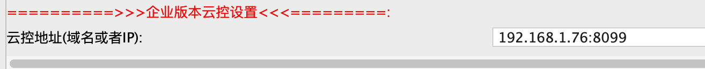

### 云控配置说明

1、从 EC 7.8.0 开始，非调试版本的域名只能从开发工具打企业版本包的时候输入，其他无输入途径

2、从 EC 7.8.0 开始，新增了云端直接动态改变apk内部域名功能

3、从 EC 7.8.0 开始，无需在apk中填写设备名称，直接在云端填写设备名称即可


### 打包域名配置


#### 直连模式

打企业版本的包，填写云控地址即可

​	


#### 动态域名

打企业版本的包，填写云控地址，例如http://192.168.1.76:8099/remote.json

！！！！一定要以json结尾！！！！

1、这个json文件可以放到阿里云的OSS文件或者是其他可以请求到的地方

2、也可以直接使用云控的站点管理 - 站点授权 - 云控链接地址设置功能，请进入站点看详细说明

3、json文件的数据生成，请进入，云控的站点管理 - 站点授权 - 云控链接地址设置，填写域名后，点击复制按钮，将复制的数据，存储到本地remote.json文件，然后将remote.json文件放到阿里云oss等存储即可

生成格式如下:

```json
{"data":"BggHBAcEBwADUQJWAlYDAQMJAwICVQMBAwYDCAJVAwECVQMHAwYDUQMIAwADCQMJAFEGCAcEBwQHAANRAlYCVgMBAwkDAgJVAwEDBgMIAlUDAQJVAwcDBgNRAwgDAAMJAwg="}
```

