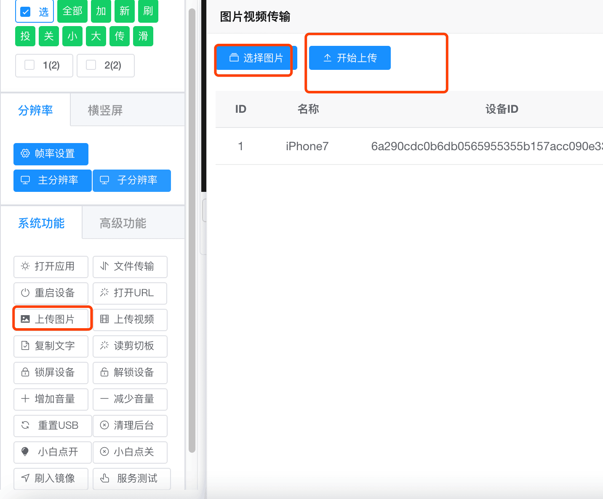
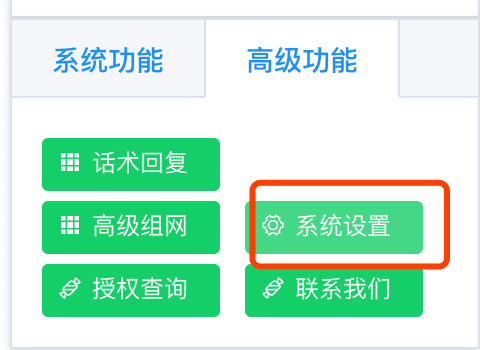
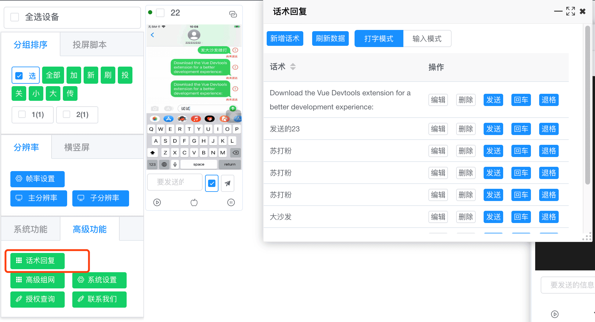
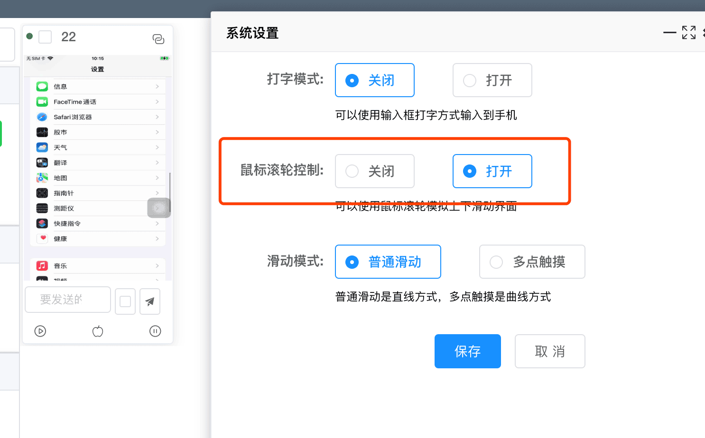
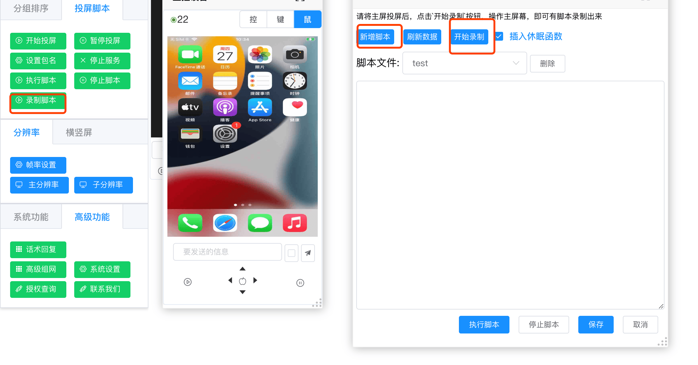

## EasyClick iOS 免越狱中控投屏使用手册（V6.5.0）

- 官网地址: https://ieasyclick.com/
- 论坛: http://bbs.ieasyclick.com/
- 123网盘：https://www.123pan.com/s/6Hlmjv-QayIA.html

## 下载文件

- 到网盘下载ioscenter_windows开头的压缩包，并且解压到文件夹，文件夹和名称不要有特殊字符、空格、中文等
- 双击ioscenter.exe开始运行中控程序

## 代理程序签名

### 自备签名

- 在压缩包解压后，里面有 easyclick-usb-agent-xxx.ipa 文件，可以自己使用P12文件签名，可以让代理商协助完成，或者参见《免越狱投屏IPA签名教程.docx》文档
- 注意：请使用网盘中的签名工具，工具名称  签名工具-ResignTool-windows.zip 
- iOS 15+系统并且是正常机器，支持企业签名

### 购买签名

- 购买签名请联系代理商或者官方推荐的签名服务商进行购买

## 安装IPA

### 安装和信任

- 用爱思安装好投屏的ipa文件到苹果手机中，并且需要找手机的系统设置 - 通用- 设备管理 - 信任开发者，如没有信任选项，可以无视
- iOS 16+，请开启开发者模式，具体请看 https://jingyan.baidu.com/article/17bd8e525171bdc4ab2bb8bd.html

### 设置开发者镜像

- 到网盘中下载DeveloperImage12.4-16.4.zip文件，解压到安装目录下的bridgebin\config\DeveloperDiskImage，文件夹中，**按照版本好排列即可**

  

### 设置包名

- 获取包名
  - 打开中控后可以看到链接的设备，右键选择某个设备，选择测试自动化
  - 
  - 点击获取应用列表，即可获取获取到手机安装的应用，找到你的代理ipa包对应的bundleId
  - 
  - 如果没有获取到应用列表，可能是没有设置对应的开发者镜像，请设置好开发者镜像后再次获取
- 中控设置包名
  - 进入到中控的中控设置页面，在代理bundleID前缀一行填写刚才获取的包名前缀，多个用英文逗号隔开，然后点击保存即可
  - 
  - 设置包名后，选择单个设备，选择开启自动化菜单，让自动化服务开始启动，如果无法启动，请再次选择测试自动化，在弹出的窗口，选择测试自动化按钮，看下返回的错误信息，发给代理商或者官方技术人员进行协助排查问题
- 投屏设置包名

  - 点击中控的集控投屏按钮，进入到投屏程序 
  - 
  - 在投屏页面-工具栏-选择投屏脚本-设置包名按钮，填写和中控一样的包名，点击保存即可
  - 

## 投屏

- 点击中控的集控投屏按钮，进入到投屏程序，并设置好包名
- 工具栏 - 全选设备 - 点击开始投屏按钮，即可进入投屏，**注意：如果设备未进行商业授权是无法进行投屏的**，如需进行授权，请看授权章节
- 单个投屏面板介绍
- 
- 面板设备信息介绍，名称签名的**绿色**代表自动化服务已经启动，**红色**代表服务未启动，**实心圈**代表是本机设备，空心圈代表是局域网组网设备
- 

## 多控

- 设置主控，鼠标放在单个投屏面板右上角的**回形针按钮**，选择设置主控，即可将该设备设为主控，也可以相同的操作取消主控
- 点击主控浮层的**投屏按钮(播放按钮)**，主控即可展示屏幕信息，如果自动化服务正常没有展示主屏，可以点击右边的开关，进行隐藏再次展示,或者直接点击右边浮动工具栏**第一个刷新按钮**刷新整个页面
- 总体介绍
- 

## 分组

- 中控和投屏界面都有分组功能，数据是互通的

### 中控分组

- 在中控设备分组栏目-右键-可以进行分组操作，默认是按照分组名称从小到大排序，例如100，101这样的排序，如果没有排序或者数据不同步，可以进行刷新

- 

- 批量设置分组，可以选择单个或者多个设备，右键选择设置分组、取消分组、设置别名等

- 

  

### 投屏分组

- 
- 小按钮解释：
  - 全选设备 - 代表选中当前屏幕的所有设备
  - 选 - 代表切换分组的时候，是否选择中设备
  - 全部 - 显示全部设备
  - 加 - 会弹出新增分组的对话框，进行新增分组、删除分组、加设备等操作
  - 
  - 新 - 快捷新增分组按钮
  - 刷 - 代表刷新分组数据
  - 投 - 代表对当前选中的设备进行快捷开启投屏操作
  - 关 - 代表对当前选中的设备进行快捷停止投屏操作
  - 小 - 代表对当前设备按照名称从小到大排序
  - 大 - 代表对当前设备按照名称从大到小排序
  - 分组点击，可以快速切换展示不同分组的设备

## 分辨率

- 投屏页面- 工具栏 - 分辨率栏目
- 帧率调整，画质越低越流畅，也可以自定义画质和帧率
  - 
- 主分辨率，对主控屏幕进行分辨率大小的调整
  - 
- 子分辨率，对子屏幕分辨率进行调整
  - 

## 横竖屏幕坐标系切换

- 横竖屏切换，可以对主屏、子屏幕进行横竖屏切换，特别适合游戏、普通app横竖屏的切换
  - 

## 快捷工具

- 投屏界面 - 右侧-悬浮工具栏，将鼠标放上去，可以看到功能提示

- 

  

  

  

  

  

## 文件传输

- 文件传输功能包含了传输视频、图片到相册，打开URL，剪切板操作组成

- 文件传输需要安装网盘的`<文件传输助手.ipa>`或者 EC 脱机版1.6.0主程序作为辅助应用

- **注意: 辅助应用ipa签名，支持爱思免费签名，超级签等，不需要特殊的工具签名**

- 在投屏界面，选择设备 - 选择系统功能 - 选择文件传输，即可弹出文件传输操作界面

- 

  - 设置辅助包名： 这个用于设置辅助应用的bundleID，获取bundleID参考之前的安装IPA和设置包名
  - 设置好了可以进行打开辅助应用，进行授权
  - 上传文件功能
    - 点击选择文件按钮，选择需要上传的图片或者视频
    - 点击开始上传，**第一次上传需要授予相册读写的权限，一定要授权才行**
    - 上传成功，可以进入相册看下图片，视频同样的上传步骤

  - 剪切板操作
    - 点击设置剪切板，输入内容，发送即可
    - 点击读取剪切板，读取的内容会在当前页面进度栏目展示
  - 打开URL
    - 点击打开URL按钮，输入http://baidu.com，点击确定，即可进行打开百度官网
    - 也可以打开抖音之类的URL Schemes, 例如抖音的是 snssdk1128://
    - **注意第一次打开应用，手机上会出现授权提示，一定要授权完成后，后续才能顺利打开**

## 系统功能

- 系统功能包含了打开应用、重启、锁屏、音量控制等，可以自行操作

## 脚本执行

### 中控执行脚本

- 中控切换到脚本栏目，可以看到脚本文件名称
- 如果没有，请在中控安装目录新建一个 script文件夹，将iec脚本文件放到该文件夹即可
- 执行脚本，先选择设备，然后双击脚本名称即可开始执行
- 
- 也可以先选择设备，然后在中控上选择 执行脚本 按钮，选择单个文件执行

### 投屏执行脚本

- 进入投屏页面 - 工具栏 - 投屏脚本栏目，先选择设备，然后选择执行脚本，即可选择单个脚本文件执行
- 

## 高级组网

### 中控组网

- 部署: 
  - 1、可以将整套中控一起复制到子电脑中运行
  - 2、可以将中控下面的bridgebin文件夹复制到子电脑，然后运行bridge-daemon.exe程序，进入守护和启动桥接的状态
- 进入中控，点击 高级组网 按钮，然后进行扫描，扫码到电脑，会在扫码结果展示，选中电脑后，点击开始组网即可
- 

### 投屏组网

- 投屏页面 - 工具栏 - 高级授权 -  高级组网
- 
- 点击开始扫描，扫描到电脑后，然后点击>按钮，点击开始组网即可
- 

## 相册操作

- 相册操作支持iOS15+的设备，低于这个版本，请用文件传输模块
- 左侧工具栏 - 系统功能 - 上传图片
- 点击选择图片，然后点击开始上传，即可看到进度提示，上传成功，一般支持jpg、png格式

- 左侧工具栏 - 系统功能 - 上传视频
- 点击选择视频，点击开始上传，即可看到上传进度，文件越大上传的越慢，支持MP4格式
- 

## 打开应用

- 6.5重新设计了打开应用功能

- 左侧工具栏 - 打开应用
- 输入包名或者URL点击打开，可以直接打开app或者url
- 输入包名或者URL，名称，点击增加，可以保存当前的应用方便后续打开
- 默认应用按钮，可以直接打开系统自带的应用
- 快捷设置按钮，是设置程序中的快捷跳转入口

## 打字模式

- 点击手机上的输入框，弹出输入法对话框的情况下，勾选底部输入框右侧的复选框，代表是打字模式
- 打字的同时会直接复制到手机的输入框，注意一定要是手机是输入的模式才行
- 

- 打字模式设置，选择工具栏-高级功能-系统设置，第一个选项，默认是使用打字模式还是默认关闭
- 

- 

## 客服快捷回复

- 选择工具栏 - 高级功能 - 话术回复
- 在手机上点击输入框，弹出输入法，进入输入状态
- 点击话术回复框中的新增话术可以添加新的快捷话术
- 点击**发送**即可将文字快速发送到手机输入框，点击回车，模拟回车键，点击退格模拟删除键
- 编辑是对话术进行重新设置，删除是删除当前话术
- 

## 鼠标滚轮跟随

- 鼠标滚动跟随，是指在投屏界面上，滚动鼠标上下滚轮，手机可以自动滑动
- 进入工具栏 - 高级功能 - 系统设置，打开鼠标滚轮控制，点击保存
- 鼠标移动到投屏界面，上下滚动鼠标即可
- 

## 投屏系统设置

- 左侧工具栏 - 系统设置按钮

- 打字模式，是指输入框可以进入边打字 边输入的状态
- 鼠标滚轮控制，是指鼠标可以控制上下滑动
- 滑动模式，可以用普通模式和多点滑动模式
- 默认主控，代表主控大界面是否展示出来
- 自动投屏，是指开启投屏程序自动进入投屏状态

## 脚本录制

- 6.2.0以上的版本才有脚本录制功能

  - 第一步将设备设置为主控，并且进行投屏
  - 

  - 第二步，选择工具栏的投屏脚本 - 录制脚本，点击新增脚本，输入脚本名称，保存就会有一个新的空脚本出来
  - 第三步，点击 **开始录制** 按钮，进入录制状态，然后在主屏幕进行点击、滑动、输入等操作即可完成录制，如果想停止录制，可以点击  **录制中** 按钮，结束录制
  - 第四步，点击保存按钮，保存脚本到中控下面
  - 
  - 第五步，选择设备，点击**执行脚本**，即可运行脚本，点击停止脚本，即可停止脚本
  - 
  - 

## 小屏幕快捷功能

- 鼠标双击小屏幕的标题，可以自动变成主控
- 鼠标放到小屏幕的回形针按钮，会弹出一些针对单个屏幕操作的快捷方式

## 购买授权

- 设备授权和投屏授权是分开的，请找代理商购买获取授权卡号

- 进入中控 - 授权中心 - 登录到中控

- 选择设备后进行右键，选择批量授权、或者单个授权

- 

- 批量授权是一行一个，填写后点击 开始授权，蓝色代表成功，红色代表失败，请注意提示信息

- 

  

## 登录注册

- 可以在中控 - 授权中心进行注册和登录
- 可以在投屏界面右上角进行注册和登录

## 常见问题

- 自动服务无法启动
  - 1、签名问题
  - 2、开发者镜像问题
  - 3、使用测试自动化功能，查看返回信息是否正确
- 投屏不显示
  - 1、使用快捷工具栏 刷新整个页面
  - 2、点击分组排序中的全部按钮，显示全部设备
- 电脑待机过少
  - 具体可以到论坛搜索相关主板配置
  - 可以采取组网模式进行分散部署
- 设备不显示
  - 1、开启爱思看看是否可以识别设备
  - 2、电脑USB是否能够正确识别
